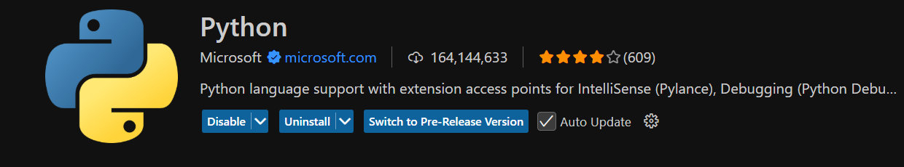

# Vorbereitung

Ubuntu enthält standardmäßig eine Python Installation.
Überprüfe ob Python bereits auf deinem Sytem installiert ist mit dem Befehl:

`python --version`

Sollte bereits eine Python Version installiert sein, schaue dass du diese aktualisieren kannst.
Version 3.13 ist die aktuell neuste Stabile Version für Windows und Mac OS. Auch bei Linus sollte es möglich sein, eine der 3er Versionen zu installieren bzw upzudaten.

Während auf windows alles mit dem command `python index.py` passiert muss auf Ubuntu scheinbar immer die Versionsnummer (Major version) mit angegeben werden, also `pyhon3 index.py`, `python3 --version`

## Installation

Hover über den Punkt Download, da steht für Windows und Mac dann bereits `Download for Windows/Mac`

- :link: [Startseite](https://www.python.org/)

**Mit etwas Glück:** Geht das auch Ubuntu auch

Falls nicht, führe folgende Befehle aus:

```
sudo apt update
sudo apt install python3
```

## Organisatisches

Für eine bessere Übersicht solltets du im DCI Ordner einen neuen Unterorder anlegen.

```
dci/
├── uib/
├── pb/
├── spa/
├── be/
└── python/
```

Für die Entwicklung mit Python gibt es spezielle Code Editoren, die dir in diveresen Tutorials empfohlen werden wie beispielsweise PyCharm. Diese haben bereits viele Hilfreiche Dinge eingebaut um die Entwicklung mit Python angenehmer zu machen. Allerdings ist auch VS-Code bei Python Entwicklern sehr beliebt.

**Installiere diese Extensions:**

IntelliSense: Autocompletion beim Tippen



Durch die Installation werden autimatisch diese beiden Extensions mit installiert:

Pylance - to provide performant Python language support
Python Debugger - to provide a seamless debug experience with debugpy
